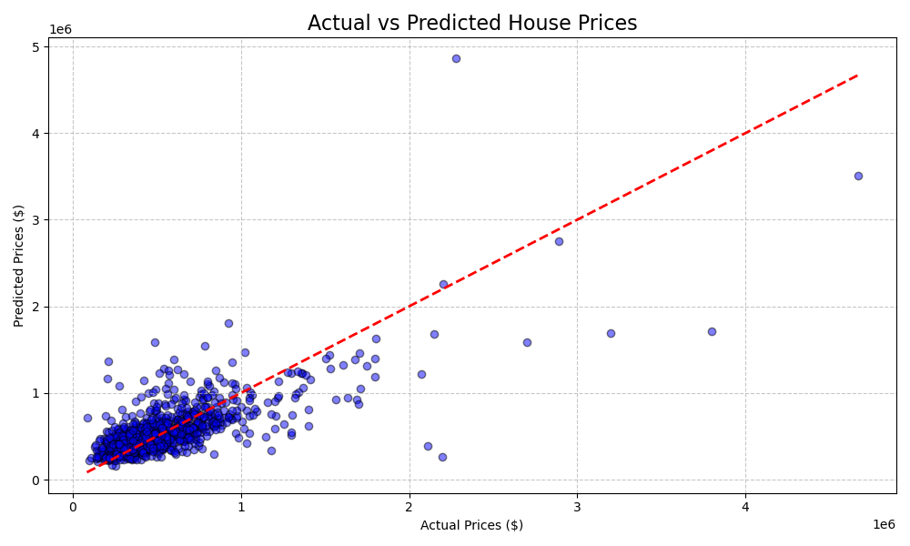
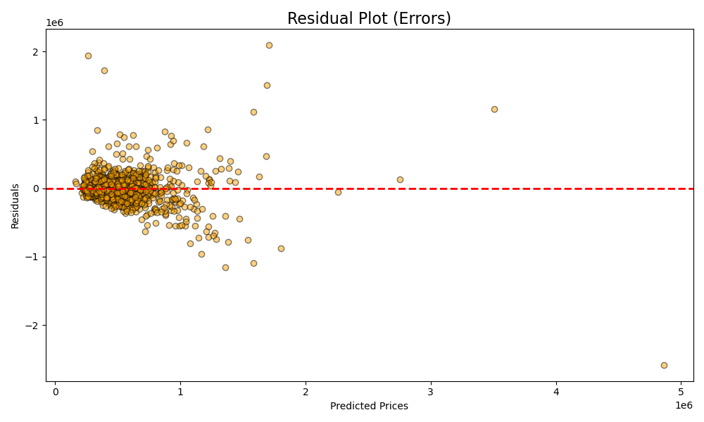
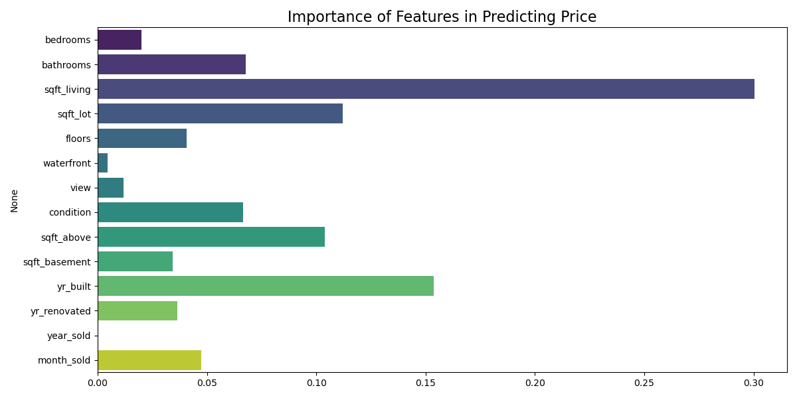
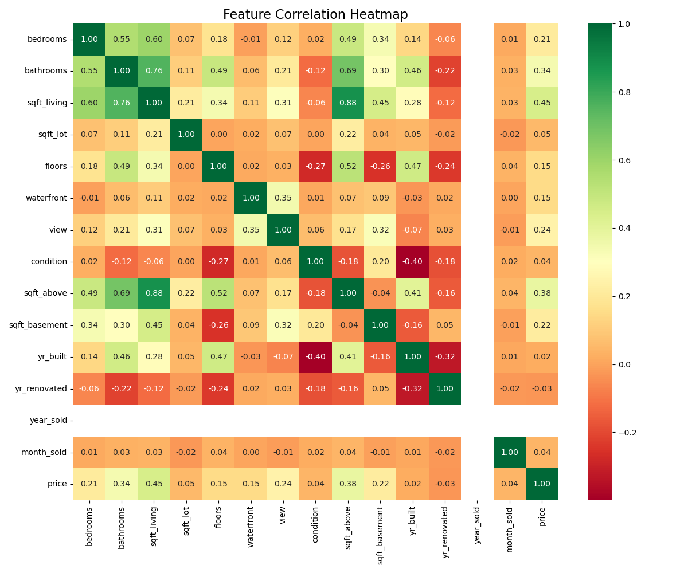

# 🏠 House Price Prediction - Pro Results

**Accuracy ($R^2$):** 0.5174
**Mean Absolute Error:** $163,325.48

## Graphical Analysis

### 1. Regression Success (Actual vs Predicted)

### 2. Error Analysis (Residual Plot)

### 3. Feature Importance

### 4. Correlation Matrix

