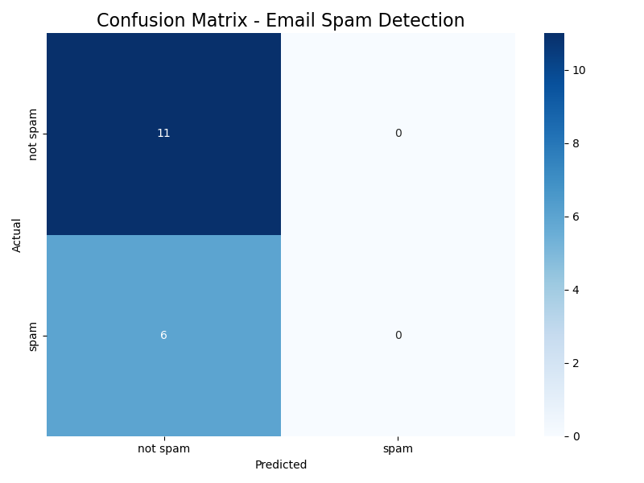
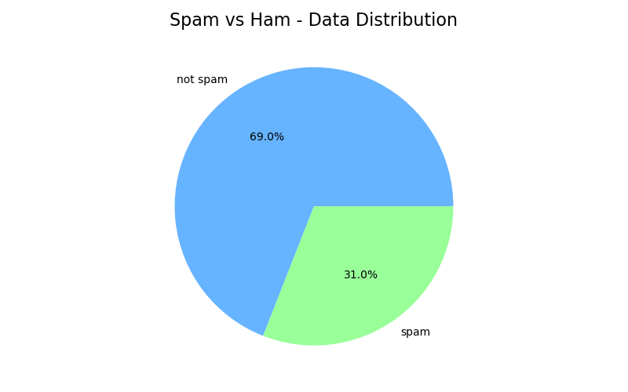
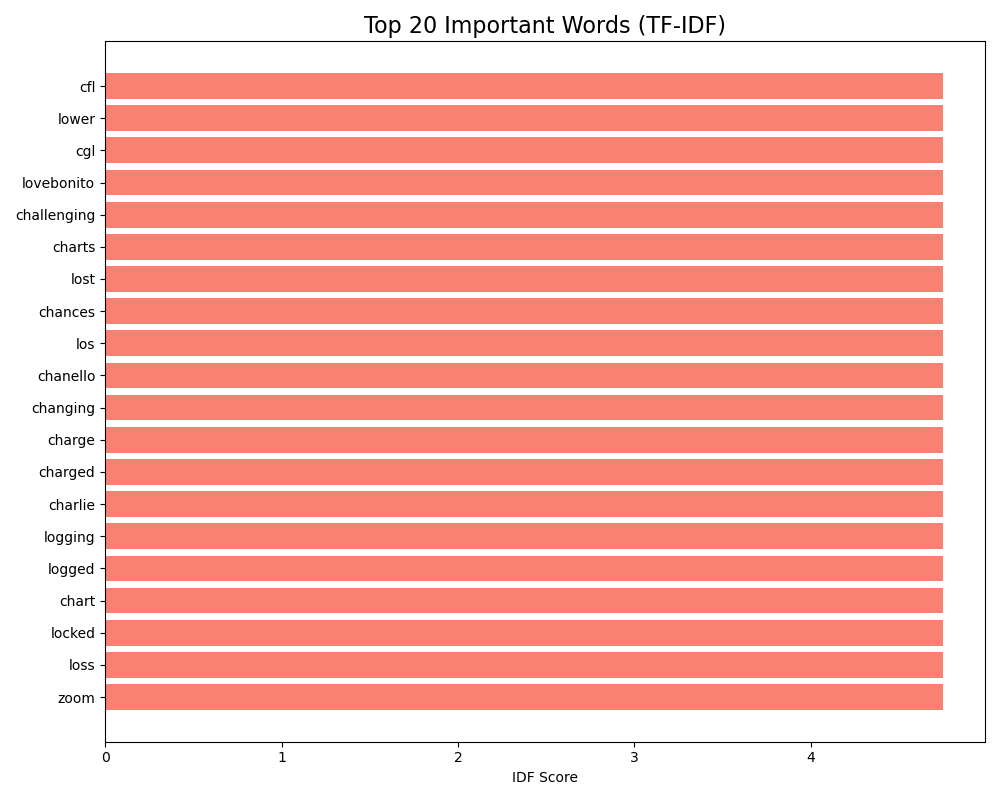

# 📧 Email Spam Detection - Pro Results

**Accuracy:** 64.71%

### Classification Report
```text
              precision    recall  f1-score   support

    not spam       0.65      1.00      0.79        11
        spam       0.00      0.00      0.00         6

    accuracy                           0.65        17
   macro avg       0.32      0.50      0.39        17
weighted avg       0.42      0.65      0.51        17
```

## Graphical Analysis

### 1. Accuracy Heatmap (Confusion Matrix)


### 2. Dataset Balance


### 3. Key Keywords Analyzed

