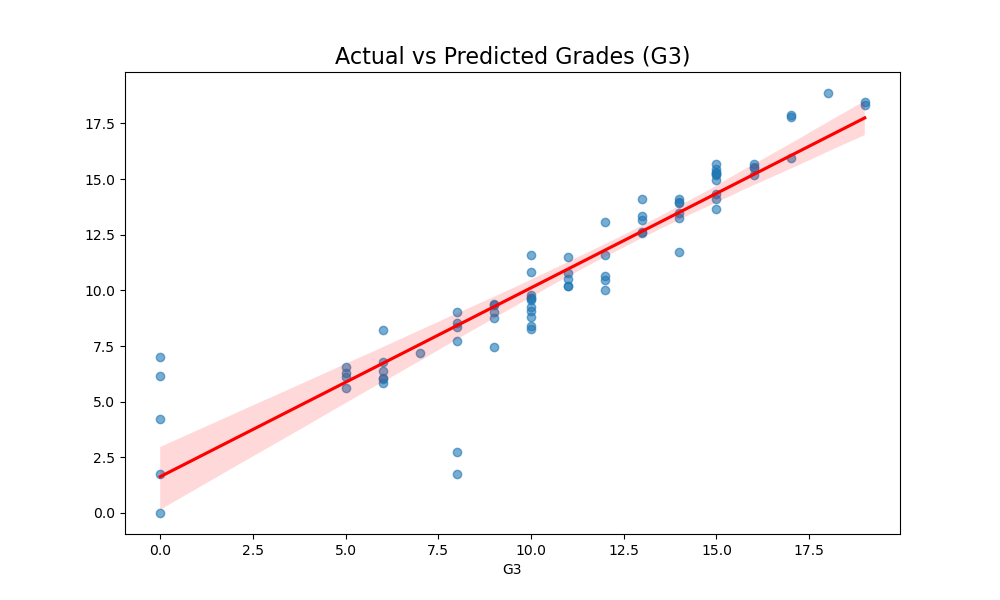
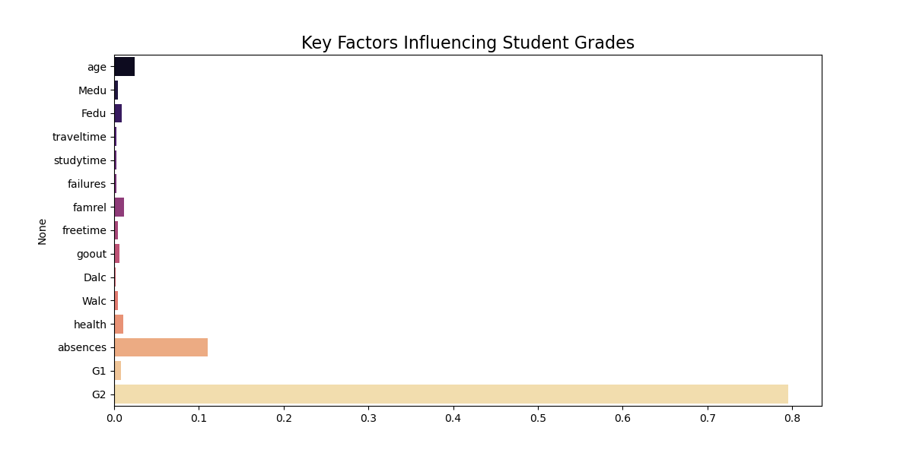
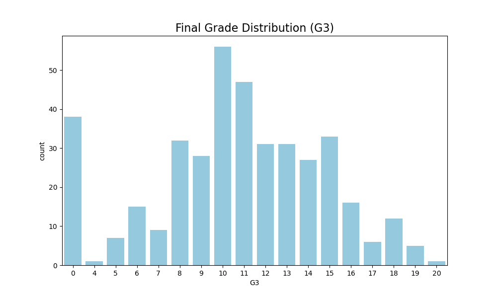
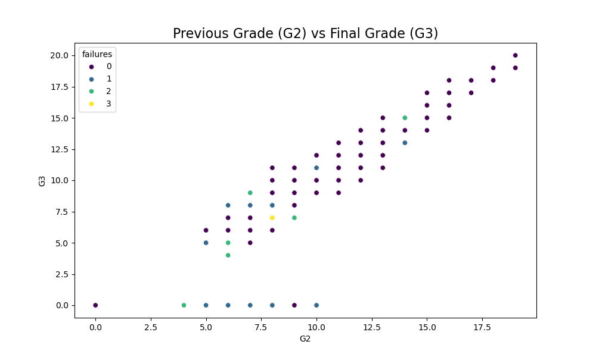

# 🎓 Student Performance - Pro Results

**$R^2$ Score:** 0.8578
**Error (RMSE):** 1.71

## Graphical Analysis

### 1. Accuracy Regression

### 2. Grade Impact Factors

### 3. Students Grade Frequency

### 4. G2 vs G3 Progress

