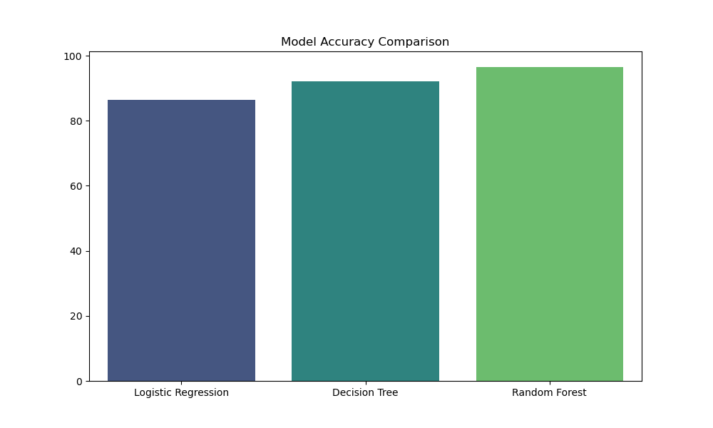
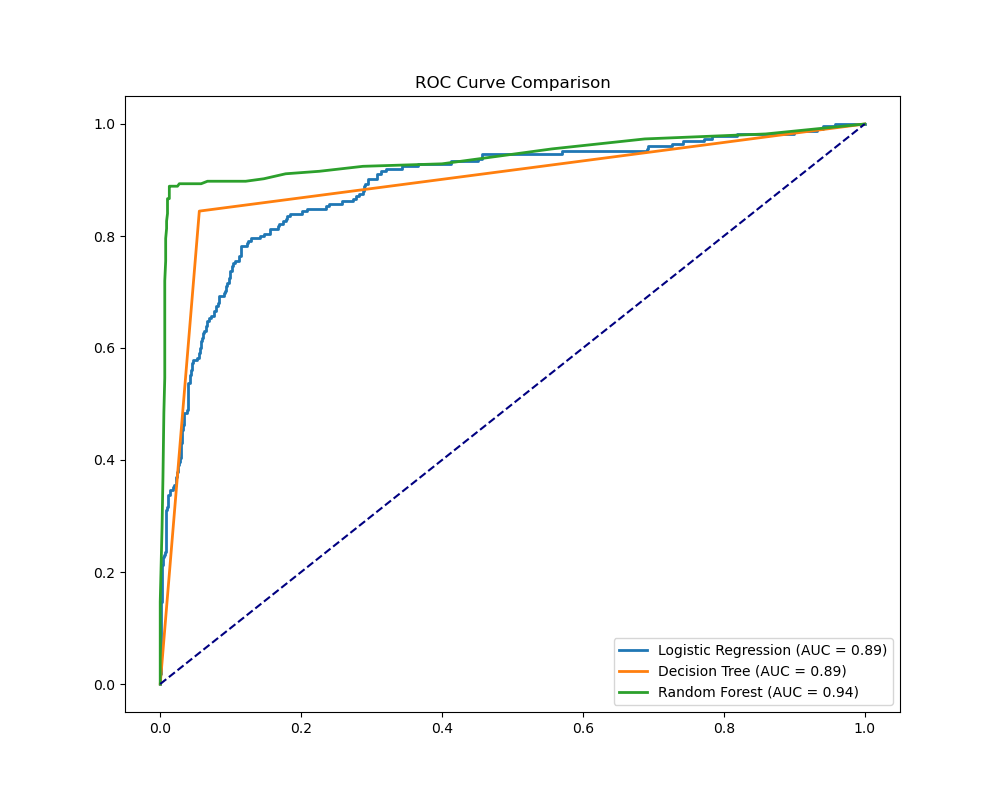

# 📊 Loan Approval Model Comparison

The task was performed using three different algorithms. The **Random Forest** performed best.

## 📈 Performance Summary

| Model | Accuracy |
| :--- | :--- |
| Logistic Regression | 86.40% |
| Decision Tree | 92.20% |
| Random Forest | 96.50% |

### Logistic Regression - Classification Report
```text
              precision    recall  f1-score   support

           0       0.89      0.94      0.91       775
           1       0.75      0.59      0.66       225

    accuracy                           0.86      1000
   macro avg       0.82      0.77      0.79      1000
weighted avg       0.86      0.86      0.86      1000
```

### Decision Tree - Classification Report
```text
              precision    recall  f1-score   support

           0       0.95      0.94      0.95       775
           1       0.82      0.84      0.83       225

    accuracy                           0.92      1000
   macro avg       0.88      0.89      0.89      1000
weighted avg       0.92      0.92      0.92      1000
```

### Random Forest - Classification Report
```text
              precision    recall  f1-score   support

           0       0.97      0.99      0.98       775
           1       0.95      0.89      0.92       225

    accuracy                           0.96      1000
   macro avg       0.96      0.94      0.95      1000
weighted avg       0.96      0.96      0.96      1000
```

## 🖼️ Visual Comparisons

### 1. Accuracy Comparison


### 2. ROC Curve Comparison


