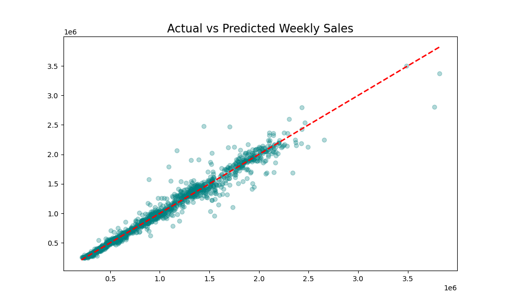
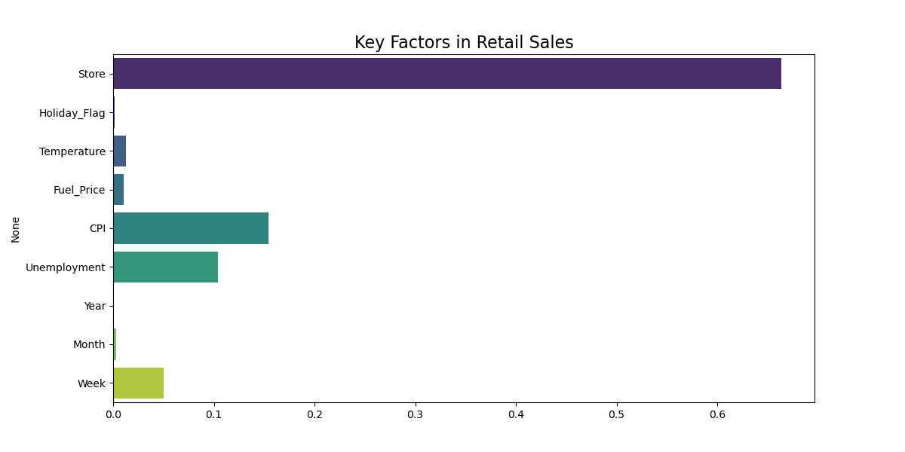
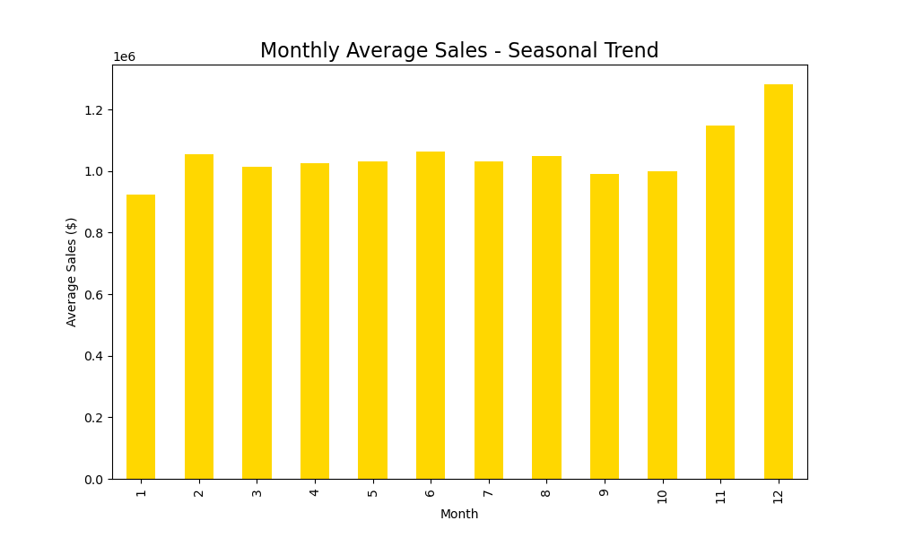
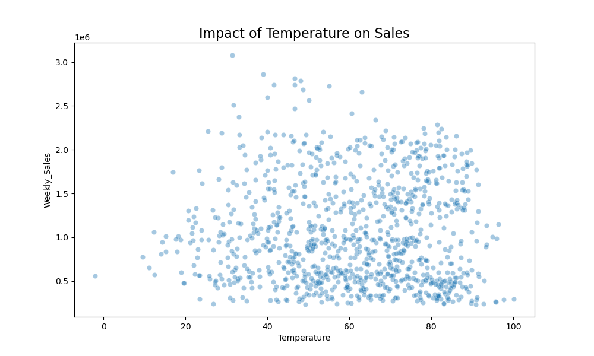

# 🛒 Walmart Sales Forecasting - Pro Results

**Model Accuracy ($R^2$):** 0.9596

## Graphical Analysis

### 1. Forecasting Confidence

### 2. Business Drivers (Feature Importance)

### 3. Seasonality Trends

### 4. External Environment (Temp vs Sales)

